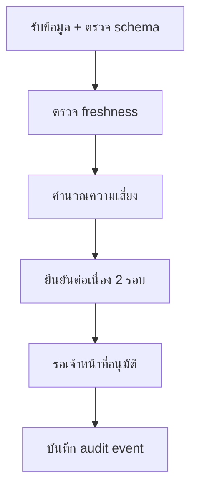

# Workflow การแจ้งเตือน

- promotion และ demotion ต้องเกิดซ้ำสองรอบ; demotion มี hysteresis 5 จุด
- stale, expired, missing หรือ invalid จะตั้งสถานะ suppressed และห้ามส่งต่อ
- หน้าเว็บแสดงข้อเสนอประกอบการตรวจสอบเท่านั้น ไม่มีการส่งข้อความหรือสั่งอพยพอัตโนมัติ
- การอนุมัติ/ปฏิเสธต้องบันทึกผู้กระทำ เวลา snapshot และเหตุผลใน `radar_alert_events`
- service-role key ใช้เฉพาะ worker ฝั่ง server และห้ามเป็นตัวแปร `NEXT_PUBLIC_*`

Migration อยู่ที่ `supabase/migrations/202609240001_radar_operational_history.sql` แต่ยังไม่ถูก apply เพราะ Supabase ที่เชื่อมอยู่ไม่ใช่โครงการ GIS นี้
