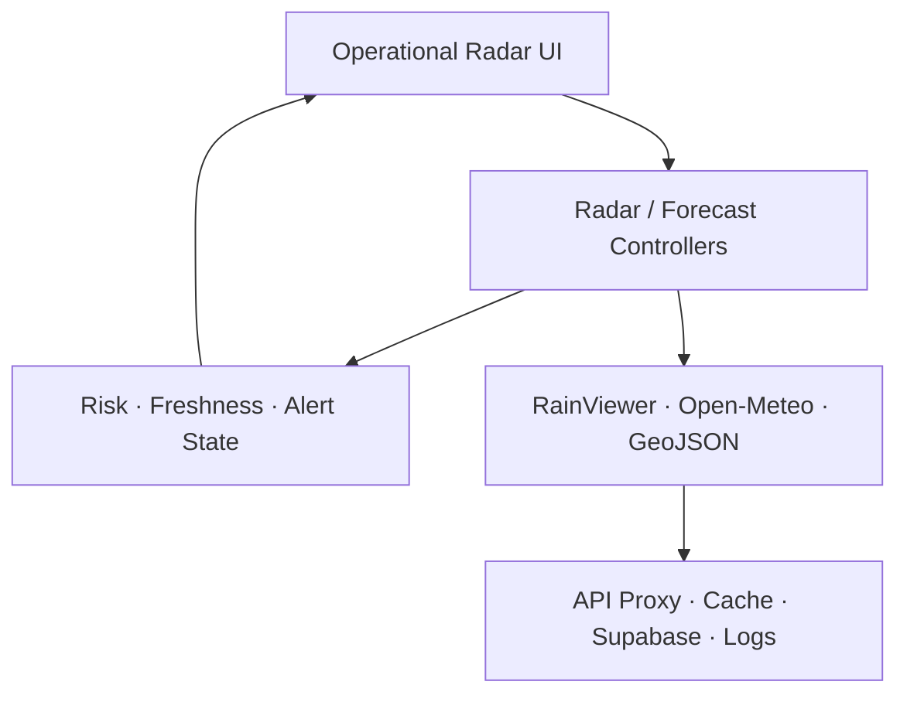

# Radar architecture and implementation plan

## CLPP Radar workflow reference

ตรวจระบบ CLPP Radar ที่เผยแพร่จริงเมื่อ 17 กันยายน 2026 และใช้เป็น reference เฉพาะแนวคิดการทำงาน ไม่คัดลอก UI, โลโก้, ชื่อผลิตภัณฑ์ หรือ branding ของ สทนช./กรมอุตุนิยมวิทยา

แนวคิดที่นำมาปรับให้เหมาะกับบ่อหลวง:

- map-first workspace พร้อมเวลาอ้างอิงที่เห็นได้ทันที
- timeline/playback สำหรับ radar observation และส่วน forecast ที่แยกความหมายชัดเจน
- layer control สำหรับ basemap, ขอบเขตการปกครอง, ป้าย, พื้นที่น้ำท่วมซ้ำซาก และจุด/พื้นที่เสี่ยงดินถล่ม
- รายละเอียดเชิงพื้นที่และเวลาเมื่อเลือกตำแหน่ง
- operational status ของแหล่งข้อมูล แทนการแสดง layer แบบไม่มีสถานะ

สิ่งที่ออกแบบใหม่สำหรับบริบทท้องถิ่น:

- ขอบเขตหลักเป็นตำบลบ่อหลวงและ 13 หมู่บ้าน ไม่ใช่มุมมองระดับประเทศ
- ranking และรายละเอียดความเสี่ยงรายหมู่บ้านเป็น primary workflow
- Radar observation, RainViewer nowcast (เมื่อมีจริง) และ Open-Meteo forecast ต้องไม่ถูกรวมเป็นข้อมูลชนิดเดียวกัน
- ทุกผลประเมินมี source, timestamp, freshness, confidence และเหตุผลประกอบ
- ข้อเสนอการปฏิบัติเป็น decision support และต้องผ่านเจ้าหน้าที่ ไม่ใช่คำสั่งอพยพอัตโนมัติ

## Source audit

### Critical

- `public/geojson/block.json` เรียง feature ไม่ตรงเลขหมู่ แต่ implementation เดิมใช้ array index เป็นเลขหมู่ ทำให้ polygon และชื่อหมู่บ้านคลาดเคลื่อน
- เมื่อ Open-Meteo ล้มเหลว implementation เดิมเก็บข้อมูลเก่าไว้โดยไม่มี error/freshness gate และยังสามารถแสดง alert ได้
- missing precipitation ถูกแทนด้วย `0` ทำให้ข้อมูลไม่ครบถูกตีความเป็นไม่มีฝน
- GeoJSON ไม่มี slope แต่ implementation เดิมถือเป็น `terrainFactor = 1.00` โดยไม่ลด confidence
- ข้อความระดับสูงเดิมมีลักษณะเป็นคำสั่งอพยพโดยไม่มี human approval

### High

- `app/radar/page.tsx` มี 1,268 บรรทัด รวม data access, cache, geometry, risk และ UI
- หน้า radar เรียก RainViewer metadata โดยตรง แม้มี `/api/radar/frames`
- village forecast ใช้ centroid เพียงจุดเดียวและไม่มี mean/max/p90
- refresh forecast ไม่มี AbortController ทำให้ผลคำขอเก่าเขียนทับคำขอใหม่ได้
- เกณฑ์และ factors ฝังใน React component
- GeoJSON errors ถูกกลืนด้วย empty catch
- ไม่มี unit/integration tests และ repository เดิมไม่มี lockfile

### Medium/Low

- มี radar implementation ซ้ำใน `components/radar/` แต่หน้าใช้งานใช้ implementation ภายใน page
- GeoJSON layer ถูก remount เมื่อ timestamp หรือหมู่บ้านที่เลือกเปลี่ยน
- health endpoint เดิมตรวจเพียง process uptime
- icon buttons บางส่วนไม่มี accessible name และ motion ยังไม่รองรับ `prefers-reduced-motion`

## Target architecture

## Files created or modified

### Created

- `lib/radar/types.ts`
- `lib/radar/threshold-config.ts`
- `lib/radar/data-freshness.ts`
- `lib/radar/risk-engine.ts`
- `lib/radar/geojson-validation.ts`
- `lib/radar/rainviewer-adapter.ts`
- `lib/radar/open-meteo-adapter.ts`
- `lib/radar/radar-tile-proxy.ts`
- `lib/radar/radar-frame-cache.ts`
- `lib/radar/village-sampling.ts`
- `lib/radar/polygon-aggregation.ts`
- `lib/radar/village-forecast.ts`
- `lib/radar/alert-state-machine.ts`
- `lib/observability/structured-logger.ts`
- `app/api/forecast/route.ts`
- `app/radar/error.tsx`
- `app/radar/loading.tsx`
- `tests/risk-engine.test.ts`
- `tests/adapters.test.ts`
- `tests/radar-pipeline.integration.test.ts`
- `tests/radar-cache-proxy.test.ts`
- `tests/village-analytics.test.ts`

### Modified

- `app/radar/page.tsx`
- `components/radar/SmoothRadar.tsx`
- `components/radar/smoothRadar.ts`
- `components/radar/radarClientCache.ts`
- `app/api/radar/frames/route.ts`
- `app/api/health/route.ts`
- `package.json`
- `package-lock.json`
- `eslint.config.mjs`
- `tsconfig.json`
- `README.md`

## Implementation phases

1. **Data correctness and freshness — completed**: adapters, schema validation, stable village identity, API7 correction, missing-data handling, source states, abort and 10-minute forecast cache.
2. **Radar pipeline — completed**: extracted tile loader/cache, abort in-flight tiles, adjacent-frame-only preload, proxy ETag/SWR, negative cache and device-quality policy.
3. **Village analytics and alert state — completed**: representative sampling 3–5 points, mean/max/p90, confidence model, two-cycle promotion, hysteresis and human approval gate.
4. **Operational UX and observability — completed in repository scope**: operational layers, separated timeline semantics, Error Boundary, skeleton/retry, structured logs, degraded mode and reduced-motion support.

## Phase 2 diff summary

- radar canvas/tile logic moved out of the page into `components/radar/` and `lib/radar/radar-frame-cache.ts`
- tile proxy validates paths, forwards ETag, handles 429/502/503 and Retry-After, and emits SWR/negative-cache headers
- changing frame or unmounting aborts requests; preload is limited to previous and next frames
- Raw/Bilinear/Bicubic defaults are selected from memory, CPU, viewport and reduced-motion preference

## Phase 3 diff summary

- every actual village polygon generates 3–5 internal representative points
- Open-Meteo coordinates are split into batches of no more than 25
- village results expose mean, max and p90; config-selected p90 drives risk assessment
- alert state records start/change time, requires two promotion/demotion cycles, applies a 5-point hysteresis margin and never sends a notification automatically

## Phase 4 diff summary

- added Error Boundary, loading skeleton, retry control, source health/degraded banner and structured JSON logs
- added the available landslide polygon layer and explicit unavailable state for recurrent-flood data
- timeline distinguishes observed frames from RainViewer nowcast and labels Open-Meteo forecast as a separate product
- removed inherited ONWR-named CSS classes; no external agency branding is reused

## Known deployment blockers

- repository has no recurrent-flood dataset; the layer remains disabled
- available landslide data is polygon hazard zoning, not surveyed risk points
- village GeoJSON has no slope attribute or referenced DEM/raster; terrain confidence therefore remains low
- Supabase RLS cannot be verified from this repository because migrations/policies and production database access are absent
- external notification delivery is intentionally not implemented; state remains `awaiting_human_approval`

## Phase 1 behavioral diff

- RainViewer metadata: external client fetch → validated same-origin API route
- Open-Meteo: direct uncached client fetch → bounded API route with 10-minute cache and timeout
- GeoJSON: unchecked/index-based → polygon validation and official name-to-village mapping
- Missing rain: implicit `0` → `null`, unknown risk and no alert eligibility
- API7: recursive `acc × 0.9 + rain` → explicit seven-day cumulative rain
- Missing slope: silent flat terrain → factor 1.00 plus low confidence and reason
- Failed/stale forecast: old alert could remain active → alert rendering requires fresh forecast state
- High-risk wording: direct evacuation text → decision-support wording requiring staff verification

## Performance baseline

- Production `/radar` route chunk before Phase 1: 60,599 bytes uncompressed.
- Local `/radar` route size after Phase 1: 20.8 kB; after Phases 2–4: 23.0 kB with 218 kB first-load JS. The final route adds polygon sampling, operational layers, state-machine status and degraded-mode UX; the heavy radar renderer is dynamically split from the main page.
- Compared with the original 17.4 kB route, the final route is 5.6 kB larger. Correctness and operational controls increased the bundle; no claim of a net bundle reduction is made.
- `block.json`: 245,764 bytes, 13 Polygon features.
- Tile concurrency before Phase 1: 4; client negative cache: 60 seconds; these protections are retained.
- Landslide GeoJSON is 1.2 MB and is now lazy-loaded only when its layer is enabled; initial GeoJSON remains the 244 kB village boundary plus the small tambon boundary.
- Automated visual desktop/mobile verification could not run because `agent-browser` is unavailable in the execution environment. HTTP smoke tests confirmed `/radar` renders HTML and degraded-mode APIs return explicit 207/502/504 responses when outbound providers are unreachable.
